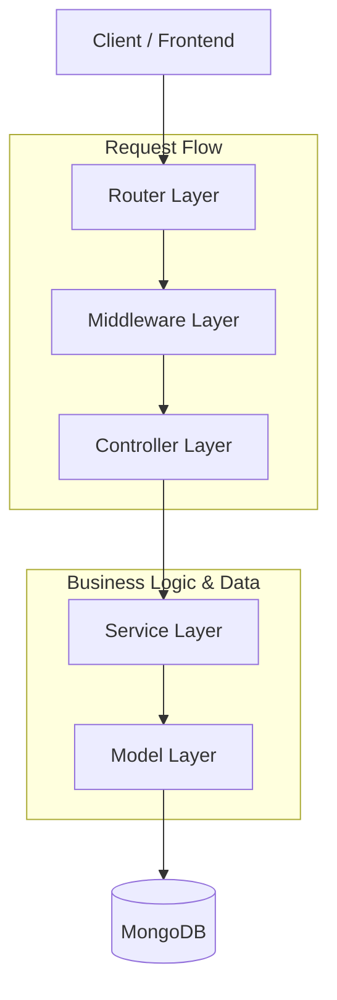

# Project Architecture

This project follows a layered architecture to ensure separation of concerns, maintainability, and scalability.

## High-Level Architecture

## Layers Description

### 1. Router Layer (`routes/`)
- Entry point for all API requests.
- Maps HTTP methods and paths to controller actions.
- Applies route-specific middlewares (auth, validation, file uploads).

### 2. Middleware Layer (`middlewares/`)
- **Authentication**: JWT verification and role-based access control.
- **Validation**: Zod schema validation for request bodies and queries.
- **Security**: Rate limiting, XSS sanitization, and NoSQL injection protection.
- **Uploads**: Multer configuration for handling product images.
- **Global Error Handler**: Centralized catch-all for errors thrown throughout the app.

### 3. Controller Layer (`controllers/`)
- Bridges HTTP and Business Logic.
- Extracts parameters from `req.params`, `req.query`, and `req.body`.
- Delegates execution to the Service Layer.
- Uses `express-async-handler` to automatically pass errors to the global error handler.
- Formats responses using `sendSuccess` and `sendError` utilities.

### 4. Service Layer (`services/`)
- Contains the core business logic.
- Directly interacts with Mongoose Models.
- Performs database operations (CRUD).
- Throws `AppError` for operational failures (e.g., 404 Not Found, 400 Bad Request).
- Independent of the HTTP transport layer (could be used by a CLI or Cron job).

### 5. Model Layer (`models/`)
- Defines Mongoose schemas and data structures.
- Implements data-level validations and virtuals.
- Defines database indexes for performance.

### 6. Validation Layer (`validations/`)
- Defines Zod schemas for strict request payload validation.
- Ensures data integrity before it reaches the services.

---

## Data Flow Example: Create Product

1. **Client** sends a POST request with image data to `/api/v1/products`.
2. **Router** receives the request and triggers:
   - `authJwt`: Verifies the user.
   - `requireAdmin`: Ensures the user is an admin.
   - `upload.array()`: Processes and saves images.
   - `validateRequest`: Validates fields against `productSchema`.
3. **Controller** (`createProduct`) extracts data and files, then calls `productService.createProduct`.
4. **Service** (`productService`) performs business checks, constructs the product object, and calls `Product.create`.
5. **Model** (`Product`) saves the data to **MongoDB**.
6. **Service** returns the created product to the Controller.
7. **Controller** sends a `201 Created` response back to the **Client**.
